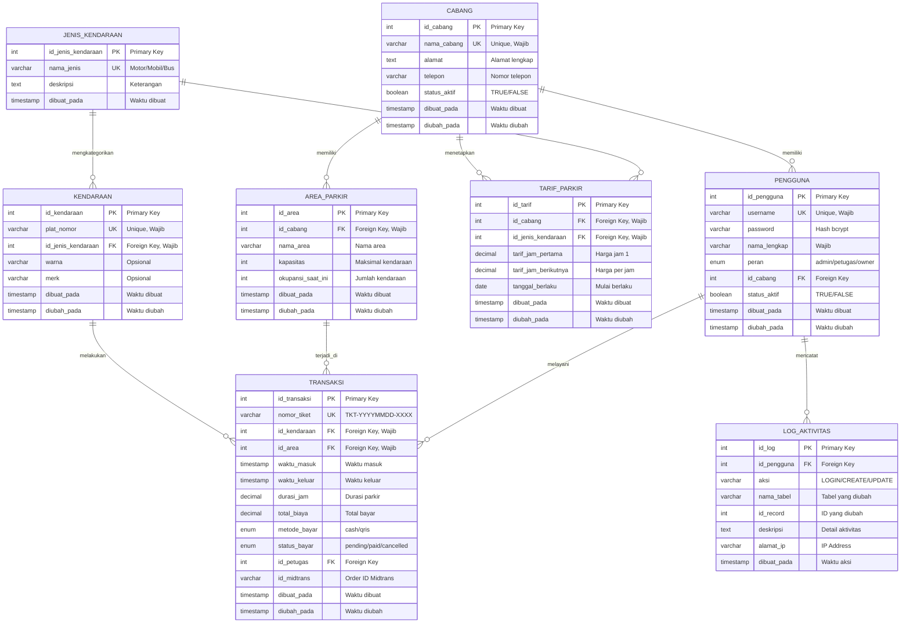

# 🗄️ ERD - BAHASA INDONESIA

## Entity Relationship Diagram Aplikasi Parkir

---

## ERD DIAGRAM (Mermaid - Bahasa Indonesia)



---

## PENJELASAN TABEL

### 1. CABANG (branches)
**Fungsi:** Menyimpan data cabang parkir untuk mendukung multi-lokasi

**Kolom:**
- `id_cabang`: ID unik untuk setiap cabang
- `nama_cabang`: Nama cabang (harus unik)
- `alamat`: Alamat lengkap cabang
- `telepon`: Nomor telepon cabang
- `status_aktif`: Apakah cabang masih beroperasi
- `dibuat_pada`: Kapan data dibuat
- `diubah_pada`: Kapan data terakhir diubah

**Contoh Data:**
```
ID: 1
Nama: Cabang Pusat
Alamat: Jl. Sudirman No. 123, Jakarta Pusat
Telepon: 021-1234567
Status: Aktif
```

---

### 2. PENGGUNA (users)
**Fungsi:** Menyimpan data pengguna sistem dengan 3 peran berbeda

**Kolom:**
- `id_pengguna`: ID unik untuk setiap pengguna
- `username`: Username untuk login (harus unik)
- `password`: Password yang sudah di-hash
- `nama_lengkap`: Nama lengkap pengguna
- `peran`: admin / petugas / owner
- `id_cabang`: Cabang tempat bekerja (untuk petugas)
- `status_aktif`: Apakah akun masih aktif
- `dibuat_pada`: Kapan akun dibuat
- `diubah_pada`: Kapan akun terakhir diubah

**Contoh Data:**
```
ID: 1
Username: admin
Nama: Administrator Utama
Peran: admin
Cabang: Cabang Pusat
Status: Aktif
```

---

### 3. AREA_PARKIR (parking_areas)
**Fungsi:** Menyimpan data area parkir dengan tracking okupansi real-time

**Kolom:**
- `id_area`: ID unik untuk setiap area
- `id_cabang`: Cabang yang memiliki area ini
- `nama_area`: Nama area (Area A, Area B, dll)
- `kapasitas`: Jumlah maksimal kendaraan
- `okupansi_saat_ini`: Jumlah kendaraan saat ini
- `dibuat_pada`: Kapan area dibuat
- `diubah_pada`: Kapan data terakhir diubah

**Contoh Data:**
```
ID: 1
Cabang: Cabang Pusat
Nama: Area A - Motor
Kapasitas: 100
Okupansi: 45
```

---

### 4. JENIS_KENDARAAN (vehicle_types)
**Fungsi:** Master data jenis kendaraan

**Kolom:**
- `id_jenis_kendaraan`: ID unik untuk setiap jenis
- `nama_jenis`: Motor / Mobil / Bus/Truk
- `deskripsi`: Keterangan jenis kendaraan
- `dibuat_pada`: Kapan data dibuat

**Contoh Data:**
```
ID: 1
Nama: Motor
Deskripsi: Sepeda motor dan skuter
```

---

### 5. TARIF_PARKIR (parking_rates)
**Fungsi:** Menyimpan tarif parkir yang bisa berbeda per cabang dan jenis kendaraan

**Kolom:**
- `id_tarif`: ID unik untuk setiap tarif
- `id_cabang`: Cabang yang menetapkan tarif
- `id_jenis_kendaraan`: Jenis kendaraan
- `tarif_jam_pertama`: Harga untuk jam pertama
- `tarif_jam_berikutnya`: Harga per jam setelah jam pertama
- `tanggal_berlaku`: Kapan tarif mulai berlaku
- `dibuat_pada`: Kapan tarif dibuat
- `diubah_pada`: Kapan tarif terakhir diubah

**Contoh Data:**
```
ID: 1
Cabang: Cabang Pusat
Jenis: Motor
Tarif Jam 1: Rp 2.000
Tarif Per Jam: Rp 1.000
Berlaku: 2024-01-01
```

---

### 6. KENDARAAN (vehicles)
**Fungsi:** Registry kendaraan yang pernah parkir

**Kolom:**
- `id_kendaraan`: ID unik untuk setiap kendaraan
- `plat_nomor`: Nomor plat kendaraan (harus unik)
- `id_jenis_kendaraan`: Jenis kendaraan
- `warna`: Warna kendaraan (opsional)
- `merk`: Merk kendaraan (opsional)
- `dibuat_pada`: Kapan data dibuat
- `diubah_pada`: Kapan data terakhir diubah

**Contoh Data:**
```
ID: 1
Plat: B 1234 ABC
Jenis: Motor
Warna: Hitam
Merk: Honda
```

---

### 7. TRANSAKSI (transactions)
**Fungsi:** Menyimpan semua transaksi parkir (masuk dan keluar)

**Kolom:**
- `id_transaksi`: ID unik untuk setiap transaksi
- `nomor_tiket`: Nomor tiket parkir (TKT-YYYYMMDD-XXXX)
- `id_kendaraan`: Kendaraan yang parkir
- `id_area`: Area tempat parkir
- `waktu_masuk`: Kapan kendaraan masuk
- `waktu_keluar`: Kapan kendaraan keluar
- `durasi_jam`: Berapa lama parkir (dalam jam)
- `total_biaya`: Total yang harus dibayar
- `metode_bayar`: cash atau qris
- `status_bayar`: pending / paid / cancelled
- `id_petugas`: Petugas yang melayani
- `id_midtrans`: Order ID dari Midtrans (untuk QRIS)
- `dibuat_pada`: Kapan transaksi dibuat
- `diubah_pada`: Kapan transaksi terakhir diubah

**Contoh Data:**
```
ID: 1
Tiket: TKT-20250211-0001
Plat: B 1234 ABC
Area: Area A - Motor
Masuk: 2025-02-11 08:00:00
Keluar: 2025-02-11 10:00:00
Durasi: 2 jam
Biaya: Rp 3.000
Metode: cash
Status: paid
```

---

### 8. LOG_AKTIVITAS (activity_logs)
**Fungsi:** Mencatat semua aktivitas penting untuk audit

**Kolom:**
- `id_log`: ID unik untuk setiap log
- `id_pengguna`: Pengguna yang melakukan aksi
- `aksi`: Jenis aksi (LOGIN, CREATE_USER, dll)
- `nama_tabel`: Tabel yang dimodifikasi
- `id_record`: ID record yang dimodifikasi
- `deskripsi`: Deskripsi detail aktivitas
- `alamat_ip`: IP address pengguna
- `dibuat_pada`: Kapan aksi dilakukan

**Contoh Data:**
```
ID: 1
Pengguna: admin
Aksi: LOGIN
Deskripsi: Admin login successful
IP: 127.0.0.1
Waktu: 2025-02-11 08:00:00
```

---

## RELASI ANTAR TABEL

### 1. CABANG → PENGGUNA (1 ke Banyak)
- **Artinya:** Satu cabang memiliki banyak pengguna
- **Contoh:** Cabang Pusat punya 5 petugas

### 2. CABANG → AREA_PARKIR (1 ke Banyak)
- **Artinya:** Satu cabang memiliki banyak area parkir
- **Contoh:** Cabang Pusat punya Area A, B, dan C

### 3. CABANG → TARIF_PARKIR (1 ke Banyak)
- **Artinya:** Satu cabang menetapkan banyak tarif
- **Contoh:** Cabang Pusat punya tarif untuk Motor, Mobil, Bus

### 4. JENIS_KENDARAAN → KENDARAAN (1 ke Banyak)
- **Artinya:** Satu jenis kendaraan punya banyak kendaraan
- **Contoh:** Jenis "Motor" punya ribuan motor yang terdaftar

### 5. JENIS_KENDARAAN → TARIF_PARKIR (1 ke Banyak)
- **Artinya:** Satu jenis kendaraan punya banyak tarif (per cabang)
- **Contoh:** Motor punya tarif berbeda di setiap cabang

### 6. KENDARAAN → TRANSAKSI (1 ke Banyak)
- **Artinya:** Satu kendaraan bisa punya banyak transaksi
- **Contoh:** Motor B 1234 ABC parkir berkali-kali

### 7. AREA_PARKIR → TRANSAKSI (1 ke Banyak)
- **Artinya:** Satu area parkir punya banyak transaksi
- **Contoh:** Area A punya ribuan transaksi per bulan

### 8. PENGGUNA → TRANSAKSI (1 ke Banyak)
- **Artinya:** Satu petugas melayani banyak transaksi
- **Contoh:** Petugas1 melayani 100 kendaraan per hari

### 9. PENGGUNA → LOG_AKTIVITAS (1 ke Banyak)
- **Artinya:** Satu pengguna melakukan banyak aktivitas
- **Contoh:** Admin melakukan login, create user, update tarif, dll

---

## RINGKASAN KARDINALITAS

| Tabel Induk | Tabel Anak | Hubungan | Arti |
|-------------|------------|----------|------|
| CABANG | PENGGUNA | 1:N | 1 cabang → banyak pengguna |
| CABANG | AREA_PARKIR | 1:N | 1 cabang → banyak area |
| CABANG | TARIF_PARKIR | 1:N | 1 cabang → banyak tarif |
| JENIS_KENDARAAN | KENDARAAN | 1:N | 1 jenis → banyak kendaraan |
| JENIS_KENDARAAN | TARIF_PARKIR | 1:N | 1 jenis → banyak tarif |
| KENDARAAN | TRANSAKSI | 1:N | 1 kendaraan → banyak transaksi |
| AREA_PARKIR | TRANSAKSI | 1:N | 1 area → banyak transaksi |
| PENGGUNA | TRANSAKSI | 1:N | 1 petugas → banyak transaksi |
| PENGGUNA | LOG_AKTIVITAS | 1:N | 1 pengguna → banyak log |

---

## ATURAN BISNIS

### 1. Integritas Data
- Setiap tabel punya Primary Key (PK) untuk identifikasi unik
- Foreign Key (FK) memastikan data terhubung dengan benar
- Unique Key (UK) mencegah duplikasi data

### 2. Validasi Data
- Nama cabang harus unik
- Username harus unik
- Plat nomor harus unik
- Nomor tiket harus unik
- Okupansi tidak boleh melebihi kapasitas

### 3. Keamanan
- Password di-hash dengan bcrypt
- Log aktivitas tidak bisa dihapus
- Soft delete untuk data penting (set status_aktif = FALSE)

### 4. Logika Bisnis
- Tarif jam pertama bisa berbeda dengan jam berikutnya
- Minimum charge: 1 jam
- Durasi dibulatkan ke atas
- Okupansi update otomatis saat entry/exit

---

## NORMALISASI DATABASE

Database ini sudah di-normalisasi ke **Bentuk Normal Ketiga (3NF)**:

### Bentuk Normal 1 (1NF) ✅
- Setiap kolom berisi nilai atomic (tidak ada array)
- Tidak ada repeating groups
- Setiap tabel punya primary key

### Bentuk Normal 2 (2NF) ✅
- Sudah 1NF
- Tidak ada partial dependency
- Semua kolom non-key bergantung penuh pada primary key

### Bentuk Normal 3 (3NF) ✅
- Sudah 2NF
- Tidak ada transitive dependency
- Kolom non-key tidak bergantung pada kolom non-key lain

**Keuntungan Normalisasi:**
- Tidak ada redundansi data
- Update anomaly tidak terjadi
- Data konsisten
- Storage efisien

---

## CARA MENGGUNAKAN ERD INI

### 1. Untuk Presentasi Ujian
```
"Pak/Bu, ini ERD sistem parkir saya. 
Ada 8 tabel utama dengan 9 relasi.
Semua dalam bahasa Indonesia agar mudah dipahami."
```

### 2. Untuk Implementasi Database
- Copy SQL dari file `database_schema.sql`
- Jalankan di MySQL
- Database siap digunakan

### 3. Untuk Dokumentasi
- Export diagram as PNG/PDF
- Include dalam laporan
- Jelaskan setiap tabel dan relasi

---

## TIPS PRESENTASI

### Opening
```
"Pak/Bu, saya akan jelaskan ERD sistem parkir saya.
ERD ini menggambarkan struktur database dengan 8 tabel."
```

### Jelaskan Tabel Utama
```
"Tabel utama ada 8:
1. CABANG - untuk multi-lokasi
2. PENGGUNA - untuk login multi-role
3. AREA_PARKIR - untuk tracking okupansi
4. JENIS_KENDARAAN - Motor/Mobil/Bus
5. TARIF_PARKIR - flexible pricing
6. KENDARAAN - registry kendaraan
7. TRANSAKSI - core business
8. LOG_AKTIVITAS - audit trail"
```

### Jelaskan Relasi
```
"Relasi penting:
- 1 cabang punya banyak pengguna dan area
- 1 kendaraan bisa punya banyak transaksi
- 1 petugas melayani banyak transaksi"
```

### Highlight Normalisasi
```
"Database sudah di-normalisasi ke 3NF:
- Tidak ada redundansi
- Data konsisten
- Update efisien"
```

### Closing
```
"ERD ini sudah diimplementasikan di database MySQL
dan sudah tested dengan sample data."
```

---

## CHECKLIST PRESENTASI

- [ ] Render ERD diagram
- [ ] Siap jelaskan 8 tabel
- [ ] Siap jelaskan 9 relasi
- [ ] Siap jelaskan normalisasi
- [ ] Siap tunjukkan sample data
- [ ] Siap jawab pertanyaan

---

**Semoga sukses dengan ujian! 🎓**

**Ingat:** ERD adalah blueprint database. Harus jelas, lengkap, dan mudah dipahami! 💪
