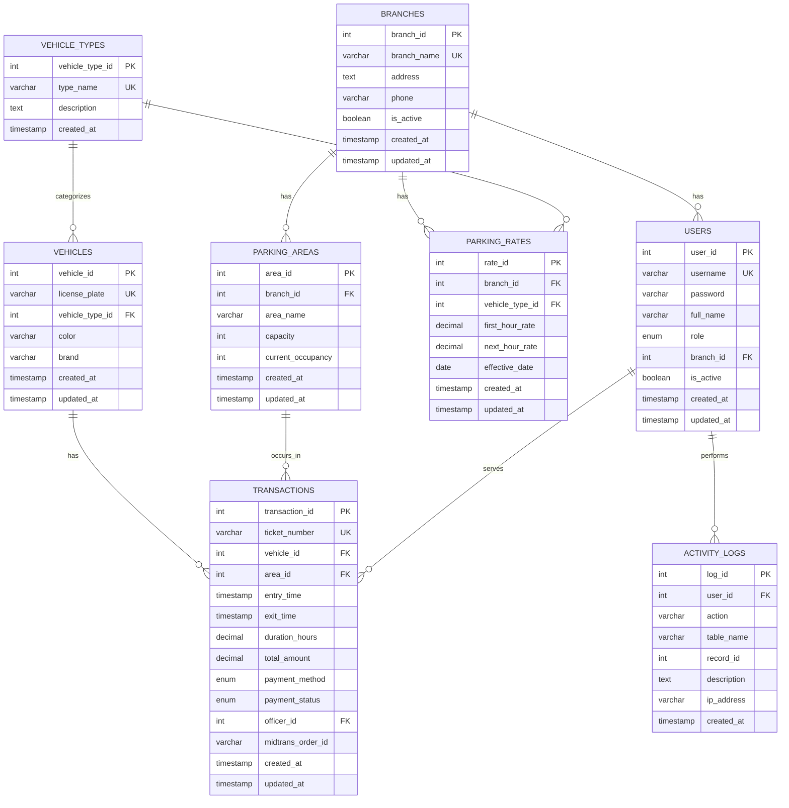
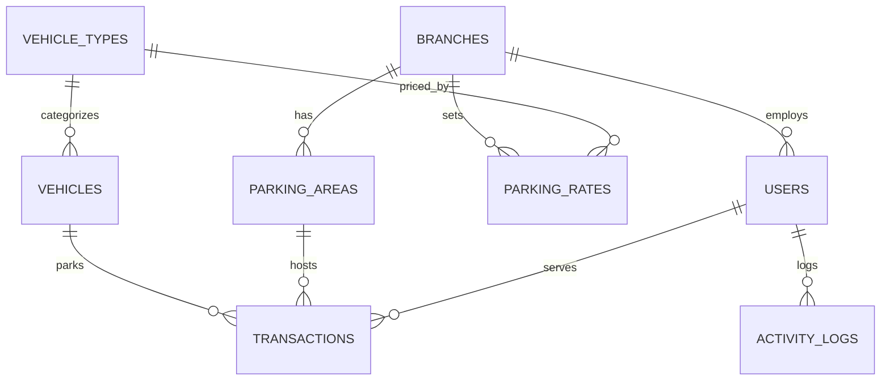

# 🗄️ ENTITY RELATIONSHIP DIAGRAM (ERD)

## Aplikasi Parkir Desktop - Mermaid Format

---

## ERD DIAGRAM (Mermaid)



---

## PENJELASAN RELASI

### 1. BRANCHES → USERS (One to Many)
- **Kardinalitas:** 1 cabang memiliki banyak user
- **Foreign Key:** users.branch_id → branches.branch_id
- **Business Rule:** Setiap user (khususnya petugas) bekerja di satu cabang

### 2. BRANCHES → PARKING_AREAS (One to Many)
- **Kardinalitas:** 1 cabang memiliki banyak area parkir
- **Foreign Key:** parking_areas.branch_id → branches.branch_id
- **Business Rule:** Setiap area parkir milik satu cabang

### 3. BRANCHES → PARKING_RATES (One to Many)
- **Kardinalitas:** 1 cabang memiliki banyak tarif
- **Foreign Key:** parking_rates.branch_id → branches.branch_id
- **Business Rule:** Tarif bisa berbeda per cabang

### 4. VEHICLE_TYPES → VEHICLES (One to Many)
- **Kardinalitas:** 1 jenis kendaraan memiliki banyak kendaraan
- **Foreign Key:** vehicles.vehicle_type_id → vehicle_types.vehicle_type_id
- **Business Rule:** Setiap kendaraan punya satu tipe (Motor/Mobil/Bus)

### 5. VEHICLE_TYPES → PARKING_RATES (One to Many)
- **Kardinalitas:** 1 jenis kendaraan memiliki banyak tarif
- **Foreign Key:** parking_rates.vehicle_type_id → vehicle_types.vehicle_type_id
- **Business Rule:** Setiap tarif untuk satu jenis kendaraan

### 6. VEHICLES → TRANSACTIONS (One to Many)
- **Kardinalitas:** 1 kendaraan memiliki banyak transaksi
- **Foreign Key:** transactions.vehicle_id → vehicles.vehicle_id
- **Business Rule:** Satu kendaraan bisa parkir berkali-kali

### 7. PARKING_AREAS → TRANSACTIONS (One to Many)
- **Kardinalitas:** 1 area memiliki banyak transaksi
- **Foreign Key:** transactions.area_id → parking_areas.area_id
- **Business Rule:** Transaksi terjadi di satu area

### 8. USERS → TRANSACTIONS (One to Many)
- **Kardinalitas:** 1 user (petugas) melayani banyak transaksi
- **Foreign Key:** transactions.officer_id → users.user_id
- **Business Rule:** Setiap transaksi dilayani oleh satu petugas

### 9. USERS → ACTIVITY_LOGS (One to Many)
- **Kardinalitas:** 1 user melakukan banyak aktivitas
- **Foreign Key:** activity_logs.user_id → users.user_id
- **Business Rule:** Log mencatat siapa yang melakukan aksi

---

## CARDINALITY SUMMARY

| Relationship | Type | Notation |
|--------------|------|----------|
| BRANCHES → USERS | One to Many | 1:N |
| BRANCHES → PARKING_AREAS | One to Many | 1:N |
| BRANCHES → PARKING_RATES | One to Many | 1:N |
| VEHICLE_TYPES → VEHICLES | One to Many | 1:N |
| VEHICLE_TYPES → PARKING_RATES | One to Many | 1:N |
| VEHICLES → TRANSACTIONS | One to Many | 1:N |
| PARKING_AREAS → TRANSACTIONS | One to Many | 1:N |
| USERS → TRANSACTIONS | One to Many | 1:N |
| USERS → ACTIVITY_LOGS | One to Many | 1:N |

---

## NORMALIZATION LEVEL

### Database ini sudah di-normalisasi ke **3NF (Third Normal Form)**

**1NF (First Normal Form):**
- ✅ Setiap kolom berisi atomic values
- ✅ Tidak ada repeating groups
- ✅ Setiap tabel punya primary key

**2NF (Second Normal Form):**
- ✅ Sudah 1NF
- ✅ Tidak ada partial dependency
- ✅ Non-key attributes fully dependent on primary key

**3NF (Third Normal Form):**
- ✅ Sudah 2NF
- ✅ Tidak ada transitive dependency
- ✅ Non-key attributes tidak depend on non-key attributes

---

## CONSTRAINTS

### Primary Keys (PK)
- branches.branch_id
- users.user_id
- parking_areas.area_id
- vehicle_types.vehicle_type_id
- parking_rates.rate_id
- vehicles.vehicle_id
- transactions.transaction_id
- activity_logs.log_id

### Foreign Keys (FK)
- users.branch_id → branches.branch_id
- parking_areas.branch_id → branches.branch_id
- parking_rates.branch_id → branches.branch_id
- parking_rates.vehicle_type_id → vehicle_types.vehicle_type_id
- vehicles.vehicle_type_id → vehicle_types.vehicle_type_id
- transactions.vehicle_id → vehicles.vehicle_id
- transactions.area_id → parking_areas.area_id
- transactions.officer_id → users.user_id
- activity_logs.user_id → users.user_id

### Unique Keys (UK)
- branches.branch_name
- users.username
- vehicle_types.type_name
- vehicles.license_plate
- transactions.ticket_number
- parking_rates (branch_id, vehicle_type_id, effective_date)

### Check Constraints
- parking_areas.current_occupancy >= 0
- parking_areas.current_occupancy <= capacity
- parking_rates.first_hour_rate > 0
- parking_rates.next_hour_rate > 0

---

## INDEXES

### Performance Optimization

```sql
-- USERS
INDEX idx_username (username)
INDEX idx_role (role)
INDEX idx_branch (branch_id)
INDEX idx_is_active (is_active)

-- PARKING_AREAS
INDEX idx_branch (branch_id)

-- PARKING_RATES
INDEX idx_branch_vehicle (branch_id, vehicle_type_id)
INDEX idx_effective_date (effective_date)

-- VEHICLES
INDEX idx_license_plate (license_plate)
INDEX idx_vehicle_type (vehicle_type_id)

-- TRANSACTIONS
INDEX idx_ticket (ticket_number)
INDEX idx_payment_status (payment_status)
INDEX idx_entry_time (entry_time)
INDEX idx_exit_time (exit_time)
INDEX idx_vehicle (vehicle_id)
INDEX idx_officer (officer_id)
INDEX idx_composite_search (payment_status, entry_time, exit_time)
INDEX idx_transaction_date_status (payment_status, exit_time)

-- ACTIVITY_LOGS
INDEX idx_user_id (user_id)
INDEX idx_created_at (created_at)
INDEX idx_action (action)
```

---

## DATA TYPES

### Numeric Types
- **INT** - ID fields, capacity, occupancy
- **DECIMAL(10,2)** - Money (rates, amounts)
- **DECIMAL(5,2)** - Duration (hours)

### String Types
- **VARCHAR(20-255)** - Short text (names, phone, etc)
- **TEXT** - Long text (address, description)

### Date/Time Types
- **TIMESTAMP** - Entry time, exit time, created_at, updated_at
- **DATE** - Effective date

### Boolean Types
- **BOOLEAN** - is_active flags

### Enum Types
- **ENUM('admin', 'petugas', 'owner')** - User roles
- **ENUM('cash', 'qris')** - Payment methods
- **ENUM('pending', 'paid', 'cancelled')** - Payment status

---

## BUSINESS RULES ENFORCED BY DATABASE

1. **Referential Integrity**
   - Foreign keys dengan ON DELETE CASCADE/SET NULL
   - Tidak bisa delete parent jika ada child

2. **Data Integrity**
   - Unique constraints untuk prevent duplicates
   - Check constraints untuk valid ranges
   - NOT NULL untuk required fields

3. **Audit Trail**
   - Timestamps (created_at, updated_at)
   - Activity logs untuk tracking changes
   - Soft delete (is_active flag)

4. **Business Logic**
   - Occupancy tidak boleh > capacity
   - Rates harus > 0
   - Ticket number harus unique

---

## CARA RENDER MERMAID

### 1. GitHub/GitLab
Paste code di file .md, akan auto-render

### 2. Mermaid Live Editor
https://mermaid.live/
- Paste code
- Export as PNG/SVG

### 3. VS Code
Install extension: "Markdown Preview Mermaid Support"
- Open .md file
- Preview (Ctrl+Shift+V)

### 4. Draw.io
Import → Advanced → Mermaid
- Paste code
- Auto-convert to diagram

---

## ALTERNATIVE: SIMPLIFIED ERD

Jika diagram terlalu kompleks, ini versi simplified:



---

## TIPS PRESENTASI ERD

### 1. Opening
```
"Pak/Bu, ini ERD sistem parkir saya. 
Ada 8 tabel utama dengan relasi yang jelas."
```

### 2. Highlight Tables
```
"Tabel utama:
- BRANCHES: Master cabang
- USERS: Multi-role (admin/petugas/owner)
- TRANSACTIONS: Core business process
- VEHICLES: Registry kendaraan
- PARKING_RATES: Flexible pricing"
```

### 3. Explain Relationships
```
"Relasi penting:
- 1 cabang punya banyak user dan area
- 1 kendaraan bisa punya banyak transaksi
- 1 transaksi dilayani 1 petugas di 1 area"
```

### 4. Highlight Normalization
```
"Database sudah di-normalisasi ke 3NF:
- No redundancy
- No partial dependency
- No transitive dependency"
```

### 5. Show Constraints
```
"Constraints untuk data integrity:
- Primary keys untuk uniqueness
- Foreign keys untuk referential integrity
- Check constraints untuk valid ranges
- Unique constraints untuk prevent duplicates"
```

---

## CHECKLIST PRESENTASI

- [ ] Tunjukkan ERD diagram (Mermaid rendered)
- [ ] Jelaskan 8 tabel utama
- [ ] Jelaskan relasi antar tabel
- [ ] Highlight normalization (3NF)
- [ ] Tunjukkan constraints
- [ ] Jelaskan business rules
- [ ] Siap jawab pertanyaan

---

**Good luck dengan presentasi ERD! 🎓**

**Remember:** ERD adalah blueprint database Anda. Harus jelas, lengkap, dan normalized! 💪
