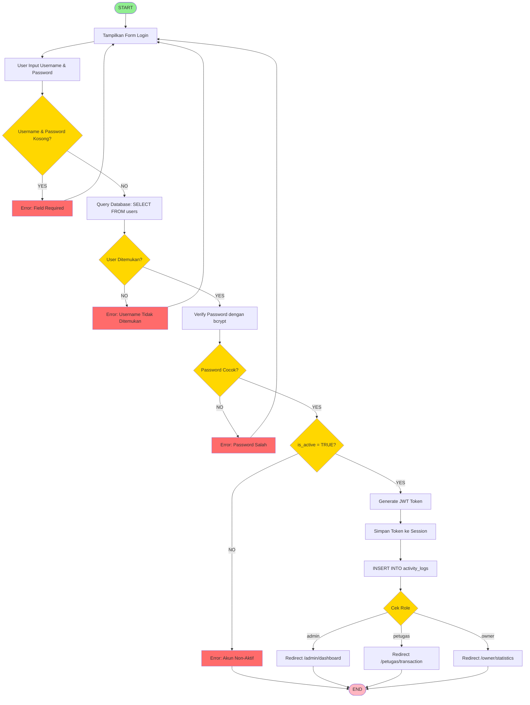
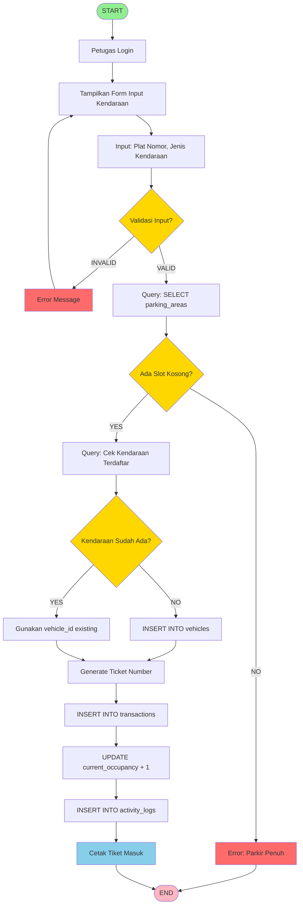
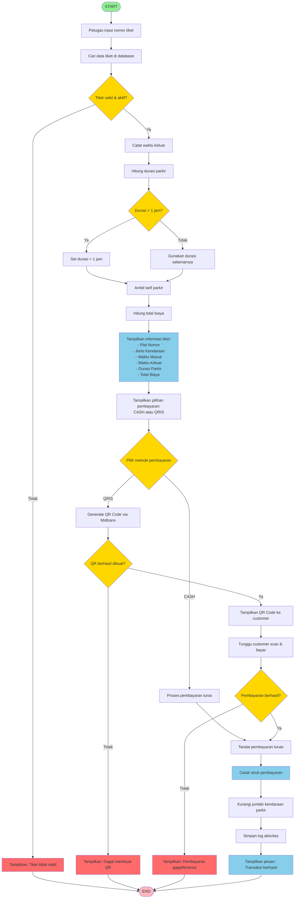
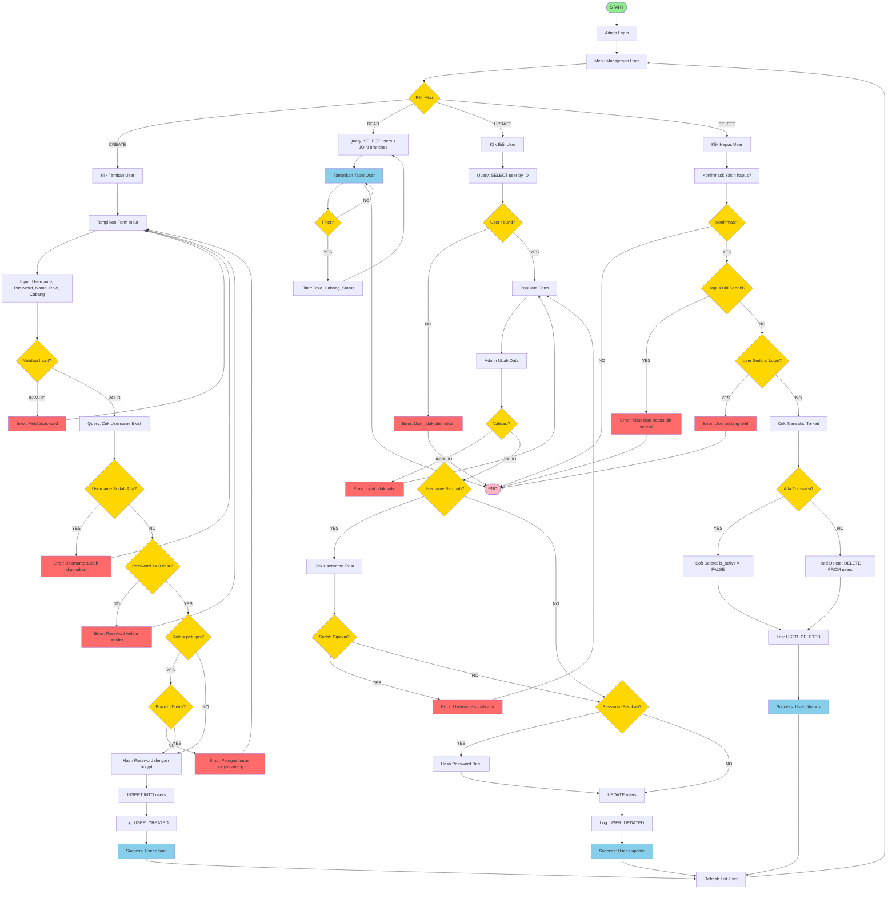
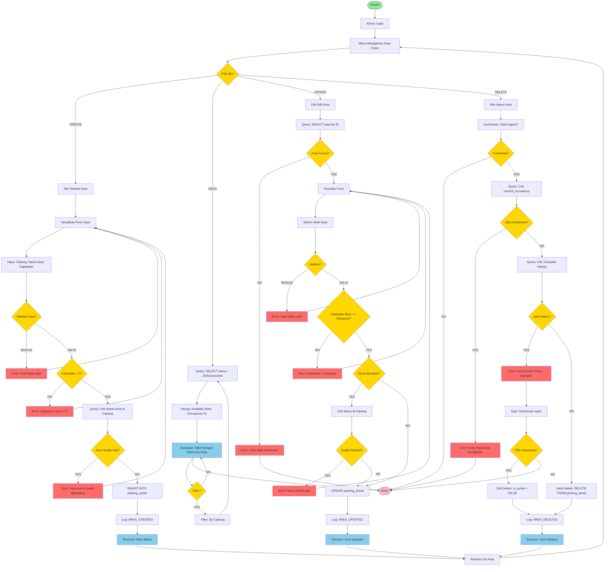

# 🔄 5 FLOWCHART FINAL - APLIKASI PARKIR

## Sesuai Soal: 3 Flowchart + 2 Tambahan

---

## FLOWCHART 1: PROSES LOGIN (dari soal a)



---

## FLOWCHART 2: PROSES TRANSAKSI (dari soal b)



---

## FLOWCHART 3: CETAK STRUK (dari soal c)



---

## FLOWCHART 4: CRUD USER - LENGKAP (tambahan 1)



---

## FLOWCHART 5: CRUD AREA PARKIR - LENGKAP (tambahan 2)



---

## RINGKASAN 5 FLOWCHART

### Dari Soal (3 Flowchart Terpisah):
1. ✅ **Proses Login** (soal a)
2. ✅ **Proses Transaksi** (soal b)
3. ✅ **Cetak Struk** (soal c)

### Tambahan (2 Flowchart CRUD Lengkap):
4. ✅ **CRUD User** - Semua operasi dalam 1 diagram
5. ✅ **CRUD Area Parkir** - Semua operasi dalam 1 diagram

---

## PENJELASAN STRUKTUR

### Yang Terpisah (a, b, c):
- Flowchart 1, 2, 3 adalah proses yang berbeda
- Tidak ada hubungan CRUD
- Masing-masing standalone process

### Yang Digabung (4, 5):
- Flowchart 4 dan 5 adalah CRUD operations
- Digabung karena satu kesatuan (Create, Read, Update, Delete)
- Lebih efisien dan jelas dalam 1 diagram

---

## TIPS PRESENTASI

### Script:
```
"Pak/Bu, saya buat 5 flowchart sesuai requirement:

3 dari soal (terpisah):
a. Proses Login
b. Proses Transaksi
c. Cetak Struk

2 tambahan (CRUD lengkap):
4. CRUD User - semua operasi dalam 1 diagram
5. CRUD Area Parkir - semua operasi dalam 1 diagram

Saya gabung CRUD karena lebih efisien dan jelas 
melihat keseluruhan proses dalam 1 flowchart."
```

---

**Good luck dengan ujian! 🎓**
