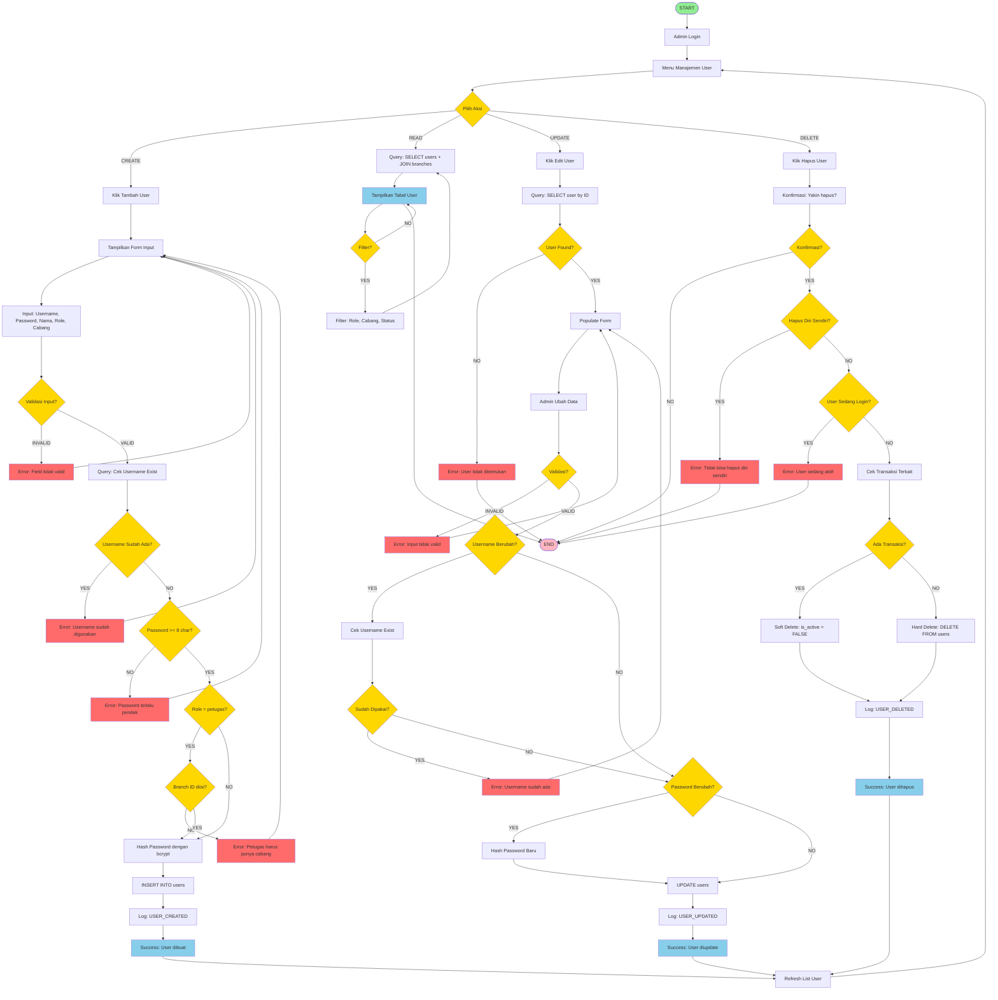
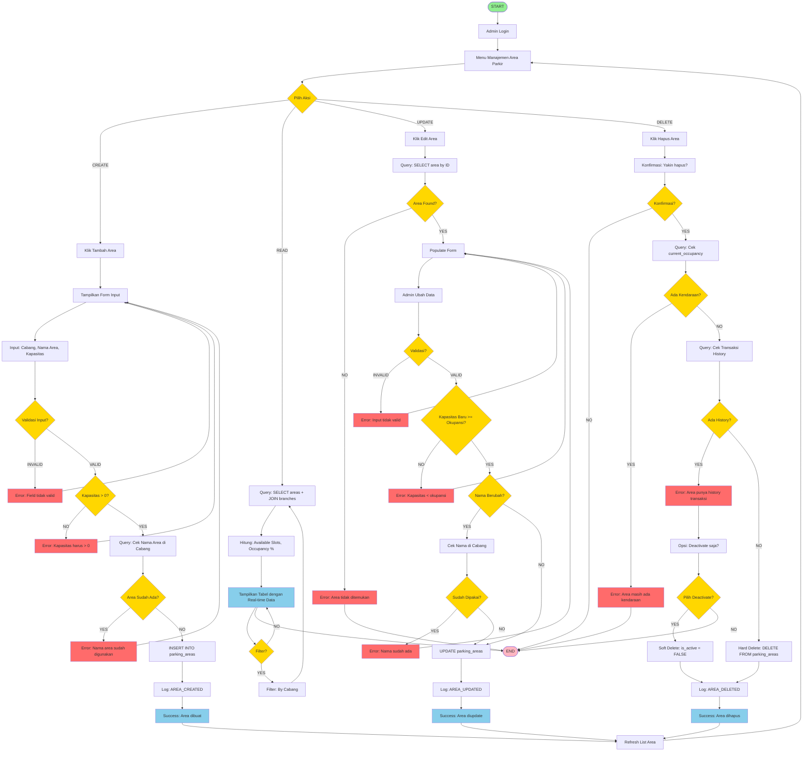

# 🔄 FLOWCHART 4 & 5 - GABUNGAN (Lengkap & Jelas)

## Flowchart Master Data yang Digabung

---

## FLOWCHART 4: CRUD USER - LENGKAP (Semua dalam 1 Diagram)



---

## PENJELASAN FLOWCHART 4 (CRUD USER)

### Alur CREATE (Tambah User):
1. Admin pilih "CREATE"
2. Input data user (username, password, nama, role, cabang)
3. Validasi:
   - Field tidak boleh kosong
   - Username harus unique
   - Password minimal 8 karakter
   - Jika role = petugas, branch_id wajib diisi
4. Hash password dengan bcrypt
5. Insert ke database
6. Log aktivitas
7. Refresh list

### Alur READ (Lihat User):
1. Admin pilih "READ"
2. Query semua user dengan JOIN branches
3. Tampilkan dalam tabel
4. Bisa filter by role, cabang, status
5. Loop kembali ke menu

### Alur UPDATE (Edit User):
1. Admin pilih "UPDATE" dan klik user
2. Query user by ID
3. Populate form dengan data existing
4. Admin ubah data
5. Validasi:
   - Jika username berubah, cek duplikasi
   - Jika password berubah, hash password baru
6. Update database
7. Log aktivitas
8. Refresh list

### Alur DELETE (Hapus User):
1. Admin pilih "DELETE" dan klik user
2. Konfirmasi hapus
3. Validasi:
   - Tidak bisa hapus diri sendiri
   - Tidak bisa hapus user yang sedang login
4. Cek transaksi terkait:
   - Jika ada transaksi: Soft delete (is_active = FALSE)
   - Jika tidak ada: Hard delete (DELETE FROM users)
5. Log aktivitas
6. Refresh list

---

## FLOWCHART 5: CRUD AREA PARKIR - LENGKAP (Semua dalam 1 Diagram)



---

## PENJELASAN FLOWCHART 5 (CRUD AREA PARKIR)

### Alur CREATE (Tambah Area):
1. Admin pilih "CREATE"
2. Input data area (cabang, nama area, kapasitas)
3. Validasi:
   - Field tidak boleh kosong
   - Kapasitas harus > 0
   - Nama area unique per cabang
4. Insert ke database
5. Log aktivitas
6. Refresh list

### Alur READ (Lihat Area):
1. Admin pilih "READ"
2. Query semua area dengan JOIN branches
3. Hitung statistik real-time:
   - Available slots = capacity - current_occupancy
   - Occupancy % = (current_occupancy / capacity) * 100
4. Tampilkan dalam tabel
5. Bisa filter by cabang
6. Loop kembali ke menu

### Alur UPDATE (Edit Area):
1. Admin pilih "UPDATE" dan klik area
2. Query area by ID
3. Populate form dengan data existing
4. Admin ubah data
5. Validasi:
   - Kapasitas baru tidak boleh < okupansi saat ini
   - Jika nama berubah, cek duplikasi
6. Update database
7. Log aktivitas
8. Refresh list

### Alur DELETE (Hapus Area):
1. Admin pilih "DELETE" dan klik area
2. Konfirmasi hapus
3. Validasi:
   - Tidak bisa hapus jika masih ada kendaraan (current_occupancy > 0)
   - Jika ada history transaksi, tawarkan soft delete
4. Pilihan:
   - Soft delete (is_active = FALSE) jika ada history
   - Hard delete (DELETE) jika tidak ada history
5. Log aktivitas
6. Refresh list

---

## KEUNGGULAN FLOWCHART GABUNGAN

### 1. Lengkap dalam 1 Diagram
- Semua operasi CRUD dalam 1 flowchart
- Mudah melihat keseluruhan proses
- Tidak perlu buka-buka banyak diagram

### 2. Jelas dan Terstruktur
- Decision point (diamond) jelas
- Error handling comprehensive
- Success path dan error path terpisah

### 3. Real-world Implementation
- Validasi lengkap
- Soft delete vs hard delete
- Activity logging
- Business rules enforcement

---

## TIPS PRESENTASI

### Script:
```
"Pak/Bu, ini flowchart CRUD User dan CRUD Area Parkir.
Saya gabung semua operasi (Create, Read, Update, Delete) 
dalam 1 diagram agar lebih lengkap dan jelas.

Flowchart ini menunjukkan:
- Validasi input yang comprehensive
- Error handling yang proper
- Soft delete vs hard delete
- Activity logging untuk audit
- Business rules enforcement"
```

### Highlight:
1. **Decision Points** - Semua kondisi jelas (diamond kuning)
2. **Error Handling** - Semua error case tertangani (kotak merah)
3. **Success Flow** - Happy path jelas (kotak biru)
4. **Business Logic** - Constraint checking (password >= 8, capacity > 0, dll)

---

**Good luck! 🎓**
    