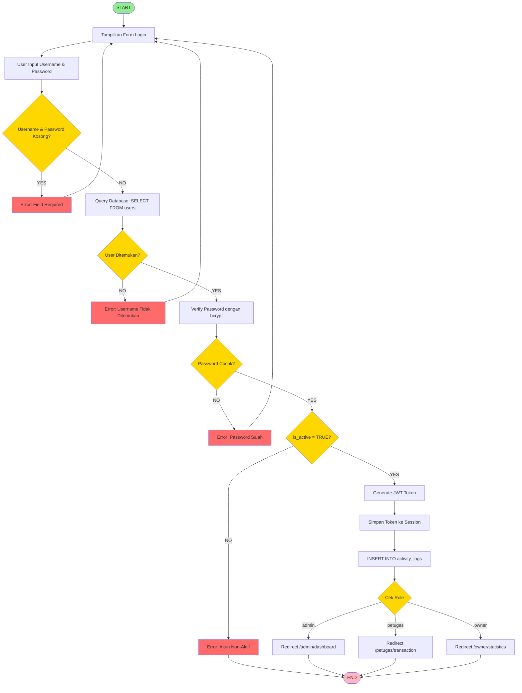
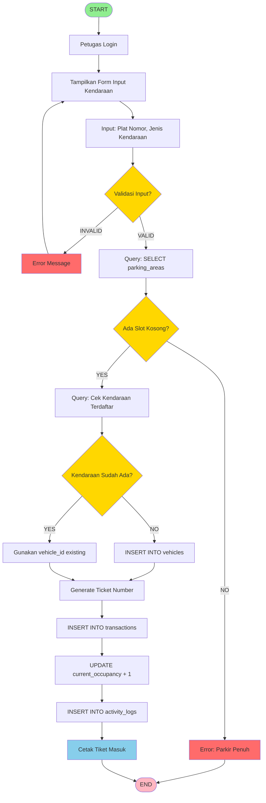
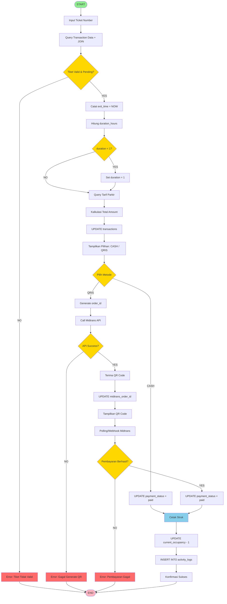
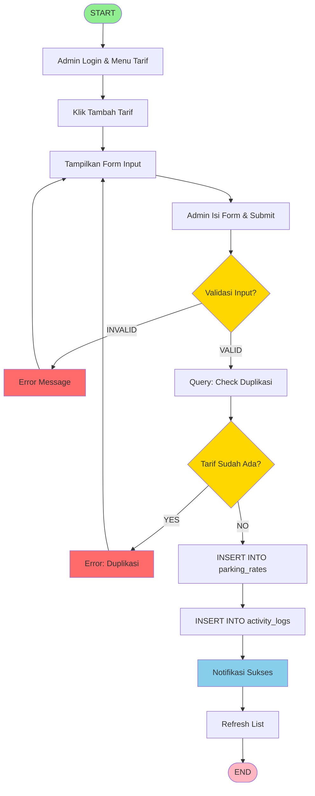
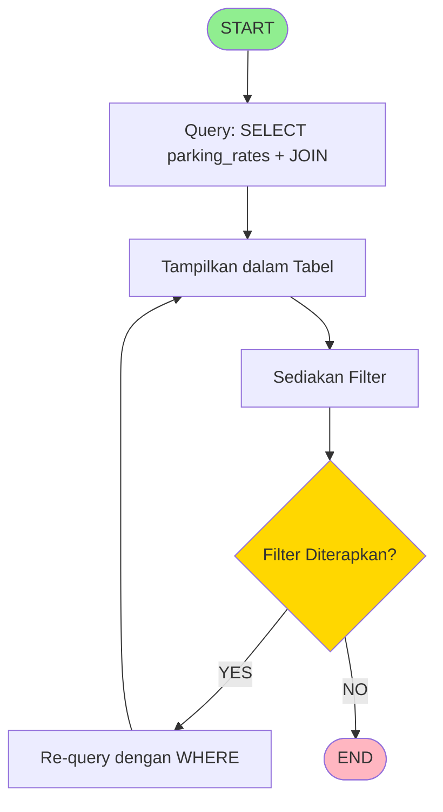
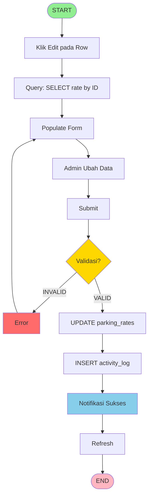
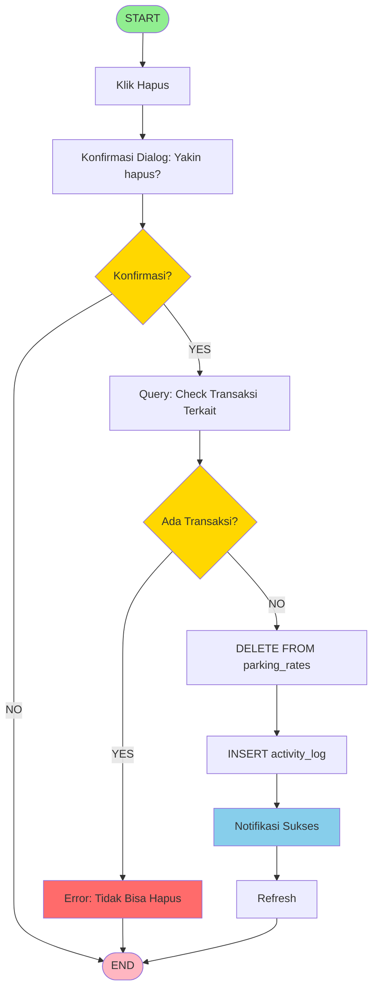
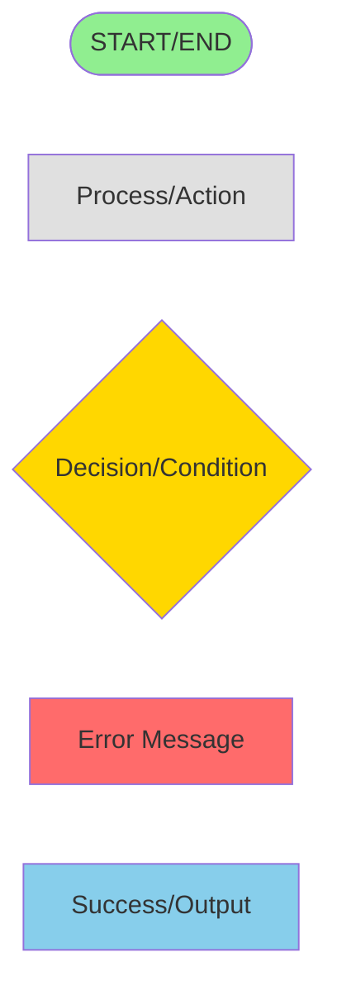

# 🔄 FLOWCHART - MERMAID FORMAT

## 5 Flowchart Utama Aplikasi Parkir

---

## FLOWCHART 1: PROSES LOGIN



---

## FLOWCHART 2: PROSES TRANSAKSI (KENDARAAN MASUK)



---

## FLOWCHART 3: CETAK STRUK PARKIR (KENDARAAN KELUAR)



---

## FLOWCHART 4: CRUD TARIF PARKIR

### 4A. CREATE (Tambah Tarif)



### 4B. READ (Lihat/Filter)



### 4C. UPDATE (Edit)



### 4D. DELETE (Hapus)



---

## FLOWCHART 5: GENERATE LAPORAN STATISTIK

```mermaid
flowchart TD
    Start([START]) --> OwnerLogin[Owner Login]
    OwnerLogin --> ShowDash[Tampilkan Dashboard]
    ShowDash --> InputFilter[Input Filter: Date, Branch, Vehicle Type]
    InputFilter --> SubmitFilter[Submit Filter]
    SubmitFilter --> Query1[Query 1: Total Pendapatan]
    Query1 --> Query2[Query 2: Jumlah Kendaraan]
    Query2 --> Query3[Query 3: Average Duration]
    Query3 --> Query4[Query 4: Breakdown by Type]
    Query4 --> Query5[Query 5: Peak Hours]
    Query5 --> Query6[Query 6: Okupansi Rate]
    Query6 --> Query7[Query 7: Payment Distribution]
    Query7 --> GenViz[Generate Visualisasi]
    GenViz --> LineChart[Line Chart: Pendapatan per Hari]
    LineChart --> BarChart[Bar Chart: Kendaraan by Type]
    BarChart --> PieChart[Pie Chart: Payment Method]
    PieChart --> HeatMap[Heat Map: Peak Hours]
    HeatMap --> Gauge[Gauge: Occupancy Rate]
    Gauge --> ShowDashboard[Tampilkan Dashboard]
    ShowDashboard --> ExportQ{Export Report?}
    ExportQ -->|YES| GenExport[Generate PDF/Excel]
    GenExport --> Download[Download]
    Download --> End([END])
    ExportQ -->|NO| End
    
    style Start fill:#90EE90
    style End fill:#FFB6C1
    style ExportQ fill:#FFD700
    style ShowDashboard fill:#87CEEB
    style Download fill:#87CEEB
```



---

## CARA RENDER FLOWCHART

### 1. GitHub/GitLab
Paste code di file .md, akan auto-render

### 2. Mermaid Live Editor
https://mermaid.live/
- Paste code
- Export as PNG/SVG/PDF

### 3. VS Code
Install extension: "Markdown Preview Mermaid Support"
- Open .md file
- Preview (Ctrl+Shift+V)

### 4. Draw.io
Import → Advanced → Mermaid
- Paste code
- Auto-convert to diagram

---

## LEGEND WARNA



**Keterangan:**
- 🟢 Hijau: START/END
- ⚪ Abu-abu: Process/Action
- 🟡 Kuning: Decision/Condition
- 🔴 Merah: Error
- 🔵 Biru: Success/Output

---

## SIMBOL FLOWCHART

| Simbol | Mermaid Code | Keterangan |
|--------|--------------|------------|
| `([text])` | Rounded | START/END |
| `[text]` | Rectangle | Process |
| `{text}` | Diamond | Decision |
| `((text))` | Circle | Connector |
| `>text]` | Flag | Output |
| `[(text)]` | Cylinder | Database |

---

## ARROW TYPES

| Code | Tampilan | Keterangan |
|------|----------|------------|
| `-->` | Solid arrow | Normal flow |
| `-.->` | Dotted arrow | Alternative flow |
| `==>` | Thick arrow | Important flow |
| `--text-->` | Labeled arrow | With label |

---

## TIPS PRESENTASI FLOWCHART

### 1. Opening
```
"Pak/Bu, ini 5 flowchart utama sistem saya 
dalam format Mermaid yang bisa langsung di-render."
```

### 2. Highlight Each Flowchart
```
"Flowchart 1: Login dengan validasi lengkap
Flowchart 2: Entry kendaraan dengan quick mode
Flowchart 3: Exit dengan dual payment (Cash/QRIS)
Flowchart 4: CRUD tarif dengan constraint checking
Flowchart 5: Generate laporan dengan visualisasi"
```

### 3. Explain Decision Points
```
"Setiap decision point (diamond) punya 2+ output:
- YES/NO untuk boolean
- Multiple options untuk pilihan
- Error handling untuk exceptional cases"
```

### 4. Show Error Handling
```
"Setiap flowchart punya comprehensive error handling:
- Validasi input
- Check constraints
- User-friendly error messages
- Graceful error recovery"
```

### 5. Closing
```
"Semua flowchart sudah diimplementasikan 
dan tested di aplikasi saya."
```

---

## CHECKLIST PRESENTASI

- [ ] Render semua 5 flowchart
- [ ] Export as PNG/PDF untuk backup
- [ ] Siap jelaskan setiap decision point
- [ ] Siap jelaskan error handling
- [ ] Siap tunjukkan implementasi di code
- [ ] Siap jawab pertanyaan

---

## EXPORT RECOMMENDATIONS

### Untuk Presentasi:
1. Export as PNG (300 DPI)
2. Background: White
3. Size: A4 landscape

### Untuk Dokumentasi:
1. Export as PDF
2. Include: All 5 flowcharts
3. Layout: One per page

### Untuk Editing:
1. Keep .md file with Mermaid code
2. Easy to update
3. Version control friendly

---

**Good luck dengan presentasi flowchart! 🎓**

**Remember:** Flowchart harus jelas, lengkap, dan mudah diikuti! 💪
