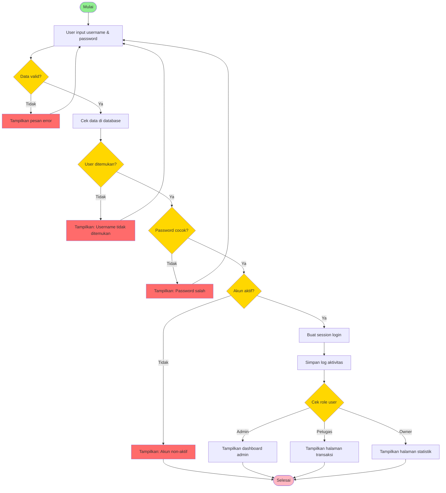
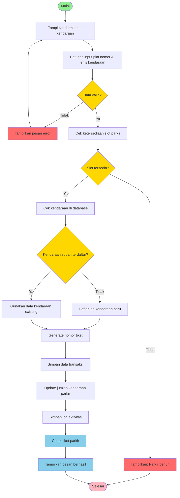
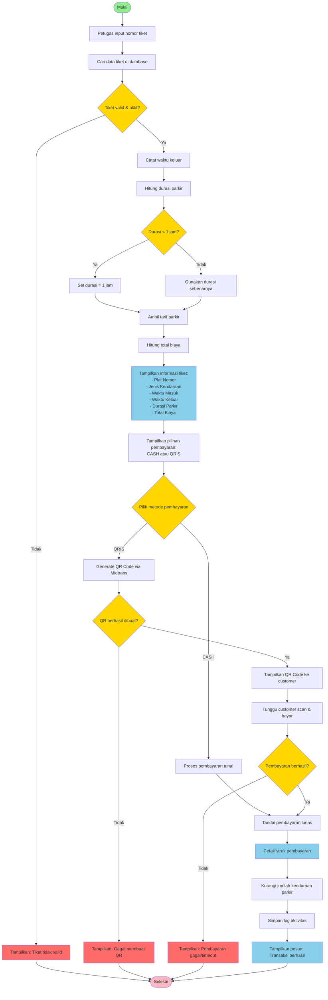
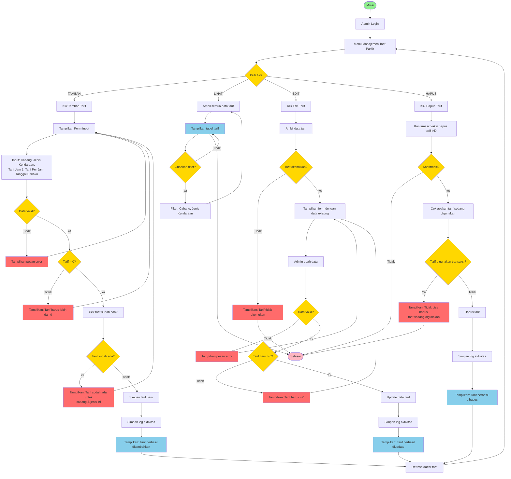
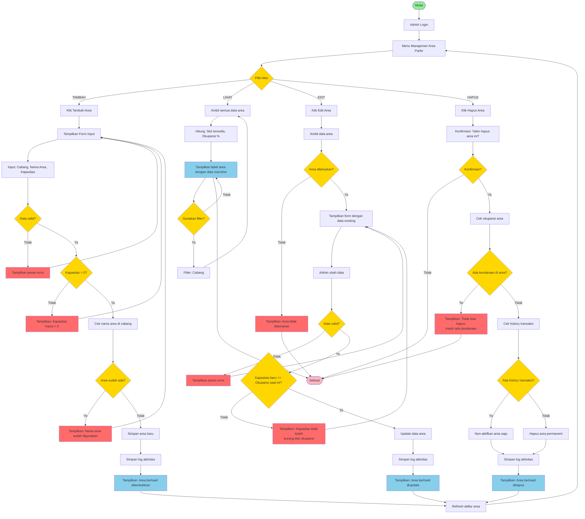

# 🔄 3 FLOWCHART DARI SOAL (Simple & Clear)

## Flowchart Sederhana Sesuai Soal

---

## FLOWCHART A: PROSES LOGIN



---

## FLOWCHART B: PROSES TRANSAKSI (Kendaraan Masuk)



---

## FLOWCHART C: CETAK STRUK (Kendaraan Keluar & Pembayaran)



---

## FLOWCHART D: CRUD TARIF PARKIR - LENGKAP (Master Data Tambahan 1)



---

## FLOWCHART E: CRUD AREA PARKIR - LENGKAP (Master Data Tambahan 2)



---

## PENJELASAN SINGKAT

### Flowchart A (Login):
1. Input username & password
2. Validasi data
3. Cek di database
4. Verifikasi password
5. Cek status aktif
6. Buat session
7. Redirect sesuai role

### Flowchart B (Transaksi Masuk):
1. Input plat nomor & jenis kendaraan
2. Validasi data
3. Cek slot tersedia
4. Cek/daftar kendaraan
5. Generate tiket
6. Simpan transaksi
7. Update slot
8. Cetak tiket

### Flowchart C (Cetak Struk):
1. Input nomor tiket
2. Validasi tiket
3. Catat waktu keluar
4. Hitung durasi & biaya
5. Tampilkan informasi tiket
6. Pilih metode pembayaran (Cash/QRIS)
7. Proses pembayaran
8. Cetak struk
9. Update slot

### Flowchart D (CRUD Tarif Parkir):
1. Admin login & pilih menu tarif
2. Pilih aksi: Tambah/Lihat/Edit/Hapus
3. Validasi data & business rules
4. Proses sesuai aksi
5. Simpan log aktivitas
6. Refresh daftar

### Flowchart E (CRUD Area Parkir):
1. Admin login & pilih menu area
2. Pilih aksi: Tambah/Lihat/Edit/Hapus
3. Validasi kapasitas & okupansi
4. Proses sesuai aksi
5. Simpan log aktivitas
6. Refresh daftar

---

## RINGKASAN 5 FLOWCHART

### 3 Flowchart dari Soal:
- ✅ **A. Login** - Autentikasi user dengan role-based access
- ✅ **B. Transaksi Masuk** - Proses kendaraan masuk parkir
- ✅ **C. Cetak Struk** - Proses keluar, pembayaran, dan cetak struk

### 2 Flowchart Master Tambahan:
- ✅ **D. CRUD Tarif Parkir** - Manajemen tarif per cabang & jenis kendaraan
- ✅ **E. CRUD Area Parkir** - Manajemen area parkir dengan monitoring real-time

---

## PERBEDAAN DENGAN VERSI SEBELUMNYA

### Lebih Simple:
- ✅ Bahasa lebih sederhana
- ✅ Fokus ke proses utama
- ✅ Tidak terlalu detail teknis
- ✅ Mudah dipahami

### Tetap Lengkap:
- ✅ Semua decision point ada
- ✅ Error handling jelas
- ✅ Happy path dan error path terpisah
- ✅ Sesuai dengan business logic
- ✅ CRUD operations digabung dalam 1 flowchart

---

## TIPS PRESENTASI

### Script Simple:
```
"Pak/Bu, ini 5 flowchart yang diminta:

3 dari soal:
A. Login - User masuk ke sistem dengan role
B. Transaksi - Kendaraan masuk parkir
C. Cetak Struk - Kendaraan keluar dan bayar (Cash/QRIS)

2 master tambahan:
D. CRUD Tarif Parkir - Manajemen tarif per cabang
E. CRUD Area Parkir - Manajemen area dengan monitoring

Semua flowchart punya validasi dan error handling 
yang jelas, tapi saya buat simple agar mudah dipahami."
```

---

**Good luck! 🎓**
