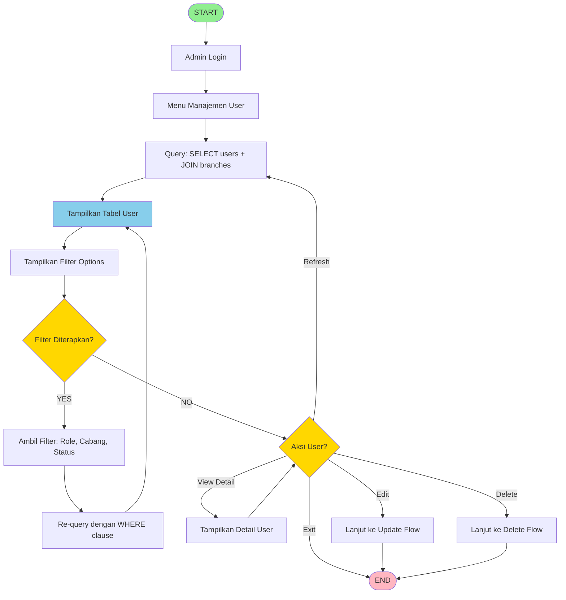
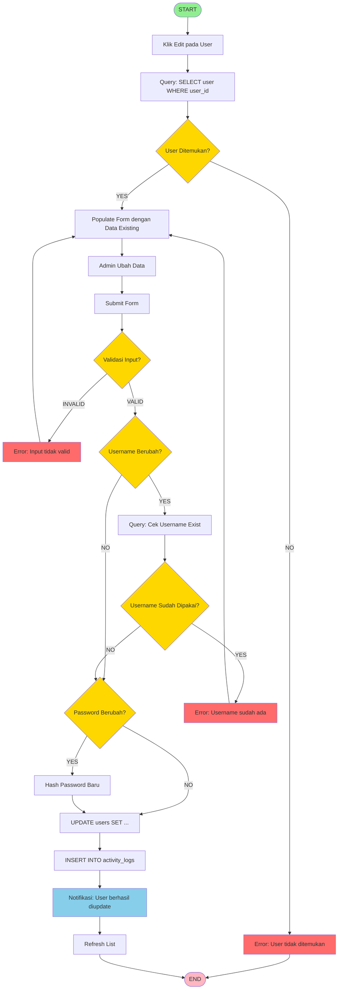
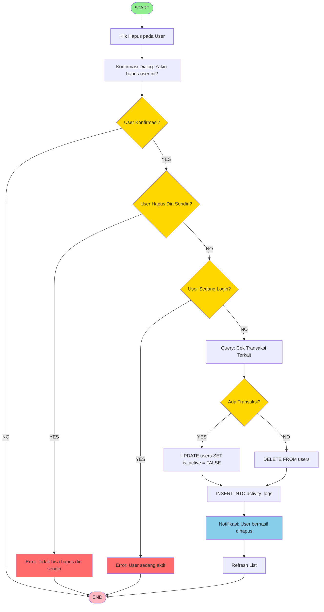
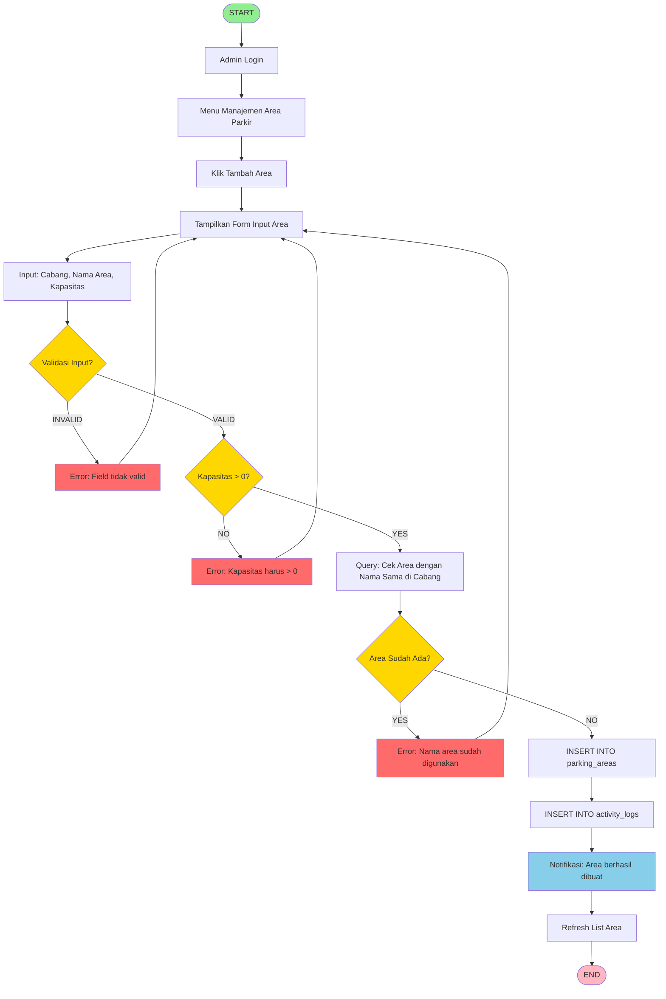
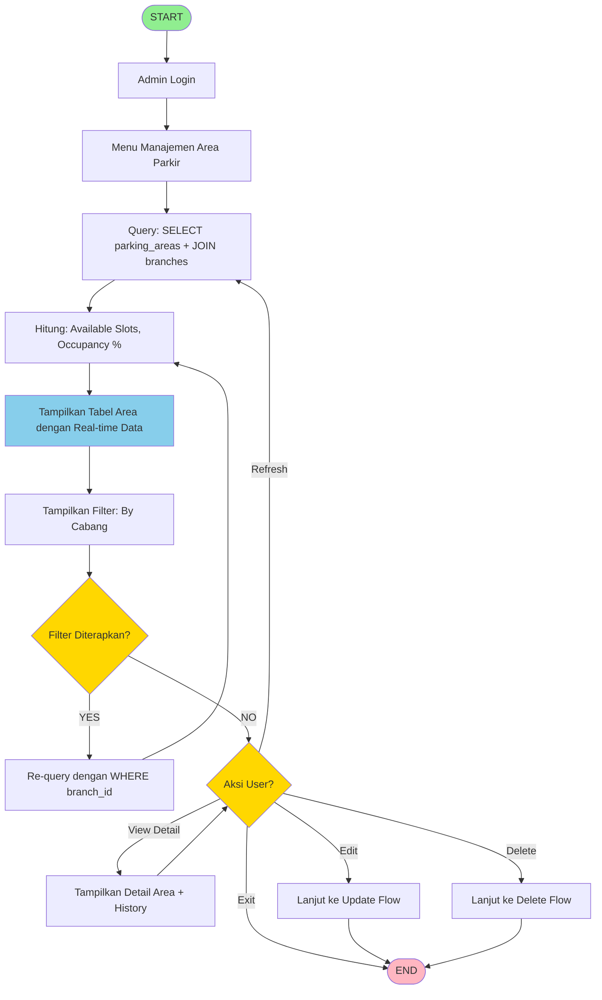
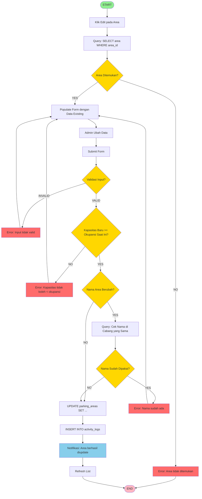
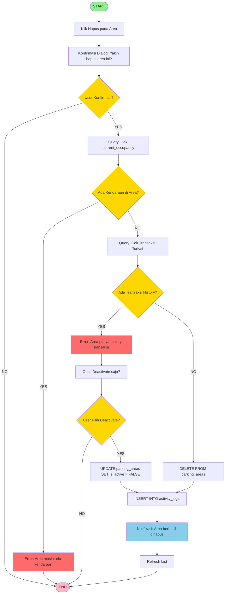

# 🔄 FLOWCHART TAMBAHAN (2 Master Data)

## Flowchart 4 & 5 - Master Data Management

---

## FLOWCHART 4: CRUD USER (Admin)

### Flowchart 4A: CREATE USER (Tambah User Baru)

```mermaid
flowchart TD
    Start([START]) --> AdminLogin[Admin Login]
    AdminLogin --> MenuUser[Menu Manajemen User]
    MenuUser --> ClickAdd[Klik Tambah User]
    ClickAdd --> ShowForm[Tampilkan Form Input User]
    ShowForm --> InputData[Input: Username, Password, Nama, Role, Cabang]
    InputData --> ValidateInput{Validasi Input?}
    
    ValidateInput -->|INVALID| ErrorValidation[Error: Field tidak valid]
    ErrorValidation --> ShowForm
    
    V ID diisi?}
    CheckRole -->|NO| HashPassword
    
    ValidateBranch -->|NO| ErrorBranch[Error: Petugas harus punya cabang]
    ErrorBranch --> ShowForm
    ValidateBranch -->|YES| HashPassword
    
    HashPassword[Hash Password dengan bcrypt] --> InsertUser[INSERT INTO users]
    InsertUser --> LogActivity[INSERT INTO activity_logs]
    LogActivity --> ShowSuccess[Notifikasi: User berhasil dibuat]
    ShowSuccess --> RefreshList[Refresh List User]
    RefreshList --> End([END])
    
    style Start fill:#90EE90
    style End fill:#FFB6C1
    style ErrorValidation fill:#FF6B6B
    style ErrorDuplicate fill:#FF6B6B
    style ErrorPassword fill:#FF6B6B
    style ErrorBranch fill:#FF6B6B
    style ValidateInput fill:#FFD700
    style UsernameExist fill:#FFD700
    style ValidatePassword fill:#FFD700
    style CheckRole fill:#FFD700
    style ValidateBranch fill:#FFD700
    style ShowSuccess fill:#87CEEB
```

---

### Flowchart 4B: READ USER (Lihat & Filter User)



---

### Flowchart 4C: UPDATE USER (Edit User)



---

### Flowchart 4D: DELETE USER (Hapus/Deactivate User)



---

## FLOWCHART 5: CRUD AREA PARKIR (Admin)

### Flowchart 5A: CREATE AREA PARKIR (Tambah Area)



---

### Flowchart 5B: READ AREA PARKIR (Lihat & Monitor)



---

### Flowchart 5C: UPDATE AREA PARKIR (Edit Area)



---

### Flowchart 5D: DELETE AREA PARKIR (Hapus Area)



---

## RINGKASAN 5 FLOWCHART

### Flowchart dari Soal (3):
1. ✅ **Login** - Autentikasi dengan validasi lengkap
2. ✅ **Kendaraan Masuk** - Entry dengan quick mode
3. ✅ **Kendaraan Keluar & Cetak Struk** - Exit dengan dual payment

### Flowchart Tambahan Master Data (2):
4. ✅ **CRUD User** - Manajemen pengguna sistem
5. ✅ **CRUD Area Parkir** - Manajemen area dengan occupancy tracking

---

## ALASAN PEMILIHAN 2 FLOWCHART TAMBAHAN

### 1. CRUD User (Flowchart 4)
**Alasan:**
- User management adalah fitur critical untuk security
- Multi-role system memerlukan validasi kompleks
- Password hashing dan validation penting untuk dijelaskan
- Menunjukkan pemahaman tentang authentication & authorization

**Kompleksitas:**
- Validasi username unique
- Password hashing dengan bcrypt
- Role-based validation (petugas harus punya cabang)
- Soft delete vs hard delete
- Self-deletion prevention

### 2. CRUD Area Parkir (Flowchart 5)
**Alasan:**
- Core business logic (occupancy tracking)
- Real-time data management
- Constraint checking (capacity vs occupancy)
- Menunjukkan pemahaman tentang business rules

**Kompleksitas:**
- Capacity validation (tidak boleh < occupancy)
- Occupancy checking sebelum delete
- Transaction history checking
- Real-time statistics calculation
- Soft delete untuk data integrity

---

## TIPS PRESENTASI

### Opening
```
"Pak/Bu, saya buat 5 flowchart:
- 3 dari soal: Login, Entry, Exit
- 2 tambahan master data: User dan Area Parkir

Saya pilih User dan Area karena paling critical 
untuk security dan business logic."
```

### Highlight Kompleksitas
```
"Flowchart User menunjukkan:
- Password hashing dengan bcrypt
- Role-based validation
- Duplicate checking
- Soft delete untuk data integrity

Flowchart Area Parkir menunjukkan:
- Real-time occupancy tracking
- Capacity constraint checking
- Business rule enforcement
- Transaction history protection"
```

### Closing
```
"Semua flowchart sudah diimplementasikan 
dan tested di aplikasi saya."
```

---

## CHECKLIST PRESENTASI

- [ ] Render semua 5 flowchart
- [ ] Siap jelaskan alasan pemilihan 2 tambahan
- [ ] Siap jelaskan kompleksitas setiap flowchart
- [ ] Siap tunjukkan implementasi di code
- [ ] Siap jawab pertanyaan

---

**Good luck dengan presentasi! 🎓**

**Remember:** Flowchart harus menunjukkan pemahaman tentang business logic dan technical implementation! 💪
